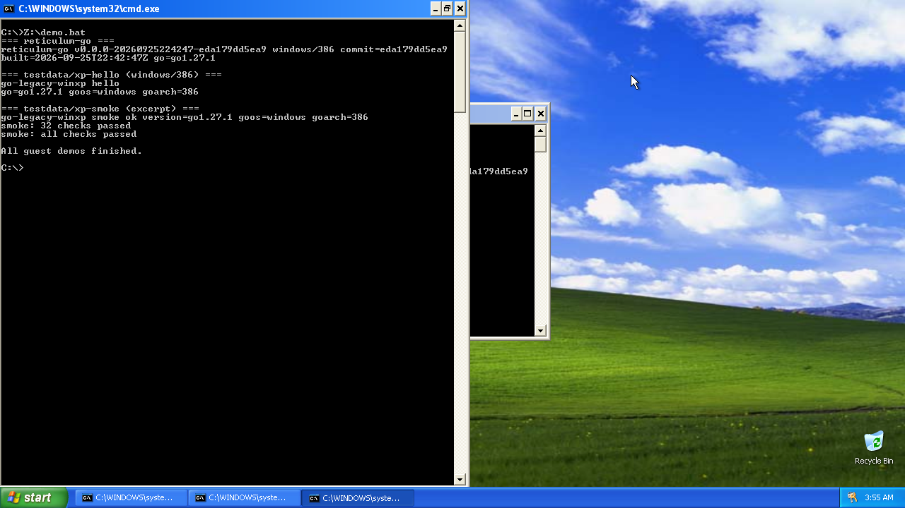
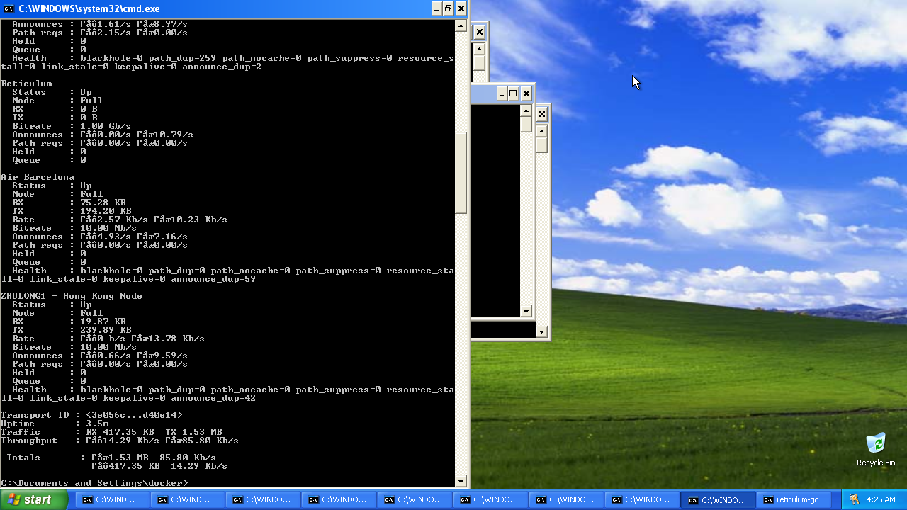

# The Go Programming Language

**go-legacy-winxp** is a fork of [go-legacy-win7](https://github.com/thongtech/go-legacy-win7) that extends legacy Windows support down to Windows XP and Server 2003, while keeping Windows 7 through Windows 11 compatibility and the restored deprecated `go get` behaviour from the win7 fork.

## Maintenance

LLMs are used to maintain and verify this repository: Cursor (Grok 4.6 / Grok 4.7). Changes are also verified by a human.

## Verified on Windows XP

Windows XP SP3 running `reticulum-go --version` and `testdata/xp-hello`, plus the 32-check smoke, all built with this toolchain for `windows/386` (PE 5.1):




_Gopher image by [Renee French][rf], licensed under [Creative Commons 4.0 Attribution licence][cc4-by]._

## Differences from Upstream Go

1. **Windows XP through Windows 11 Support**  
   While the official Go project dropped support for Windows 7 and older in Go 1.21, this fork maintains compatibility with Windows XP, Server 2003, Windows 7, 8, 8.1, Server 2008 R2, Server 2012, and Server 2012 R2.

   Windows XP targets use PE major version 5 and avoid linking against Vista+ APIs that are loaded dynamically at runtime when available.

2. **Classic `go get` Behaviour**  
   This fork allows for the deprecated `go get` behaviour when `GO111MODULE` is set to "off" or "auto". This means:

   - In `GOPATH/src`, `go get` and `go install` can operate in `GOPATH` mode.
   - Outside of `GOPATH/src`, these commands can use module-aware mode when appropriate.

3. **Compatibility Notes**  
   Some newer Go features may not be fully compatible with the oldest Windows versions. Use `GOARCH=386` for Windows XP when possible. The race detector build remains intended for Windows 10+ only.

## Changes in Each Release

Current release includes all [go-legacy-win7](https://github.com/thongtech/go-legacy-win7) modifications, plus:

- Set PE minimum target major version to 5 for Windows XP binaries
- Load Vista+ kernel32 APIs dynamically instead of static import (`CreateWaitableTimerExW`, `GetErrorMode`, `GetQueuedCompletionStatusEx`, `RaiseFailFastException`, `WerGetFlags`, `WerSetFlags`, `AddVectoredContinueHandler`)
- Fall back to `SetUnhandledExceptionFilter` when `AddVectoredContinueHandler` is unavailable
- Fall back to `GetQueuedCompletionStatus` in the runtime netpoller when `GetQueuedCompletionStatusEx` is unavailable
- Fall back to `SetErrorMode` when `GetErrorMode` is unavailable
- Fall back to `CancelIo` and no-op proc-thread attribute helpers when those APIs are unavailable
- Fall back to `NtSetInformationFile` when `SetFileInformationByHandle` and `GetFinalPathNameByHandle` are unavailable
- Includes all improvements and bug fixes from the corresponding upstream Go release

Inherited from go-legacy-win7 1.27.1:

- PE images default to Windows 7 (6.1) in the win7 parent, then this fork stamps 5.1 for XP
- System DLLs load by absolute path where `LOAD_LIBRARY_SEARCH_SYSTEM32` is rejected
- `ProcessPrng` falls back to `RtlGenRandom` when bcryptprimitives is missing
- Console handle, directory info, socket inherit, and completion-port fallbacks from the win7 patch series
- Restored deprecated `go get` behaviour for use outside modules

We provide two build options for Windows amd64:

- **Standard build**  
  Maximum compatibility with legacy Windows, including XP, with the reverted race detector.

- **Race detector build** (version suffix `-race`)  
  Uses Go's latest stable race detector without modifications. Recommended for Windows 10+ when running race tests.

## Download and Install

Binary releases are published from this repository's Releases page after the first workflow run.

### Before you begin
To avoid PATH/GOROOT conflicts and mixed toolchains, uninstall any existing Go installation first.

#### Windows Installation

1. Download the `go-legacy-winxp-<version>.windows_<arch>.zip` file.
2. Extract the ZIP to `C:\` (or any preferred location). This will create a `go-legacy-winxp` folder.
3. Add the following to your system environment variables:
   - Add `C:\go-legacy-winxp\bin` (or your chosen path) to the system `PATH`.
   - Set `GOROOT` to `C:\go-legacy-winxp` (or your chosen path).
4. Add the following to your user environment variables:
   - Add `%USERPROFILE%\go\bin` to the user `PATH`.
   - Set `GOPATH` to `%USERPROFILE%\go`.

#### macOS and Linux Installation

1. Download the appropriate `go-legacy-winxp-<version>.<os>_<arch>.tar.gz` file.

   - For macOS: `go-legacy-winxp-<version>.darwin_<arch>.tar.gz`
   - For Linux: `go-legacy-winxp-<version>.linux_<arch>.tar.gz`

2. Extract the archive to `/usr/local`:

   ```
   sudo tar -C /usr/local -xzf go-legacy-winxp-<version>.<os>_<arch>.tar.gz
   ```

3. Add the following to your shell configuration file:

   - For bash, add to `~/.bash_profile` or `~/.bashrc`
   - For zsh, add to `~/.zshrc`

   ```bash
   export GOROOT=/usr/local/go-legacy-winxp
   export GOPATH=$HOME/go
   export PATH=$PATH:$GOROOT/bin:$GOPATH/bin
   ```

4. Apply the changes:

   - For bash: `source ~/.bash_profile` or `source ~/.bashrc`
   - For zsh: `source ~/.zshrc`

   Note:

   - On macOS Catalina and later, zsh is the default shell.
   - On most Linux distributions, bash is the default shell.

After installation, verify the installation by opening a **new terminal** and running:

```
go version
```

The version string should report `go1.27.1` from this tree.

### Docker toolchain build

```
docker build -f docker/build/Dockerfile -t go-legacy-winxp .
```

The image `go` binary is at `/usr/local/go-legacy-winxp/bin/go`.

### Continuous integration

The `CI` workflow builds this toolchain with a Go 1.24.6 bootstrap and runs `scripts/check-xp-pe.sh` on every pull request and on `master`. That is the check that must pass on GitHub-hosted runners.

`XP Compatibility Test` is `workflow_dispatch` only. It does not run on pull requests, so hosted runners are not queued to wait on QEMU. Dispatch it on a machine with `/dev/kvm`, or run `./scripts/test-xp-docker.sh` locally. Guest results come back over the dockurr samba share (`Z:`).

Draft binary releases are produced by `Go Build Release` (`workflow_dispatch`). The workflow builds a host toolchain from the dispatch commit, cross-compiles each `GOOS/GOARCH` target, and uploads archives to a draft GitHub release.

### Live reticulum-go on Windows XP

Windows XP SP3 running [Reticulum-Go](https://github.com/Quad4-Software/Reticulum-Go) as a shared instance, with MeshChatX clearnet TCP and backbone hubs from https://meshchatx.com/api/mcx-interfaces (Catz, US-East, Germany 002, rns.h.acked.co.uk, RNS4All, Air Barcelona, ZHULONG1). All seven were Up with RX/TX traffic:



After the guest is up and `reticulum-go-winxp.exe` is on the samba share (`Z:`):

```
python3 scripts/fetch-mcx-config.py
./scripts/live-reticulum-xp.sh
```

`scripts/fetch-mcx-config.py` writes `testdata/xp-reticulum/config` with online clearnet IPv4 `TCPClientInterface` and `BackboneInterface` hubs. I2P and Yggdrasil are skipped. The guest config sets `enable_sandbox = no` and `shared_instance_type = tcp`.

On hosts where the Docker compose network cannot originate internet TCP, `live-reticulum-xp.sh` starts `scripts/mcx-host-relay.py` on `172.18.0.1` and `scripts/xp-guest-nat.sh` DNATs the guest hub IPs through that relay. Status comes back as `docker/xp/shared/live-status.txt`.

### Windows XP guest smoke test (Docker)

```
./scripts/test-xp-docker.sh
```

The guest UI is at `http://127.0.0.1:8006/` (noVNC). The test builds PE 5.1 smoke binaries, optionally builds [Reticulum-Go](https://github.com/Quad4-Software/Reticulum-Go) for `windows/386`, and runs both inside `dockurr/windows` `VERSION=xp`.

On bare metal, QEMU uses KVM. Inside a nested hypervisor (or when the host KVM module oopses), the script falls back to TCG via `XP_KVM=N`. Force either mode with `XP_KVM=Y` or `XP_KVM=N`.

### Install From Source

To install from source, please follow the steps on the [official website](https://go.dev/doc/install/source).

## Contributing

Feedback and issue reports are welcome, and we encourage you to open pull requests to contribute to the project.

Note that the Go project uses the issue tracker for bug reports and
proposals only. See https://go.dev/wiki/Questions for a list of
places to ask questions about the Go language.

[rf]: https://reneefrench.blogspot.com/
[cc4-by]: https://creativecommons.org/licenses/by/4.0/
